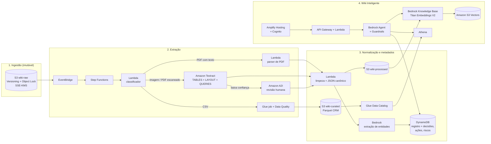

# 🧭 A Wiki Perdida dos Arquivos Corporativos — Proposta de Arquitetura AWS

> **Resumo executivo.** Os três arquivos de `raw/` são tratados por três caminhos diferentes, escolhidos pelo **conteúdo** e não pelo nome ou pasta: o PDF tem camada de texto e é lido diretamente (sem OCR), a imagem PNG passa pelo **Amazon Textract**, e o CSV do CRM vira **tabela consultável** (Glue + Athena) em vez de texto picado em trechos. Tudo converge para um formato normalizado, é enriquecido com metadados pelo **Amazon Bedrock**, indexado em uma **Bedrock Knowledge Base** e consultado por um **Bedrock Agent** que combina busca semântica (atas) com consultas SQL (CRM) e sempre cita a fonte original — com arquivo, versão e página.

---

## Sumário

1. [Quest 1 — O Mapa dos Arquivos Perdidos](#-quest-1--o-mapa-dos-arquivos-perdidos)
2. [Quest 2 — O Portal de Entrada na AWS](#-quest-2--o-portal-de-entrada-na-aws)
3. [Quest 3 — A Relíquia dos Metadados](#-quest-3--a-relíquia-dos-metadados)
4. [Quest 4 — O Oráculo da Wiki Inteligente](#-quest-4--o-oráculo-da-wiki-inteligente)
5. [Segurança, governança, custos e evolução](#-segurança-governança-custos-e-evolução)

### Visão geral da arquitetura



Transversal a tudo: **IAM** (menor privilégio), **KMS** (chaves próprias), **CloudTrail** (auditoria), **CloudWatch** (logs, métricas, alarmes), **Macie** (dados sensíveis), **SQS DLQ + SNS** (falhas).

---

## 🗺️ Quest 1 — O Mapa dos Arquivos Perdidos

### 1.1 O que existe em `raw/` (verificado abrindo os arquivos)

| Arquivo | Formato real | Natureza | Precisa de OCR? | Conteúdo |
|---|---|---|---|---|
| `ata_reuniao_vendas_sa.pdf` | PDF 1.7, 5 páginas, fontes embutidas (Noto Serif) | **Digital nativo** — possui camada de texto | **Não** | Ata de 08/07/2026 (código VSA-COM-2026-07): 6 participantes, painel de indicadores de junho, discussões, 5 decisões (D-001 a D-005), 6 ações (A-001 a A-006), 4 riscos (R-01 a R-04), próxima reunião em 03/08/2026 |
| `ata_resultados_vendas_novos_dados.png` | PNG 1900×2700, RGB | **Escaneado** — só pixels | **Sim** | Ata de 15/01/2026 sobre resultados do 2º semestre: tabela de 6 indicadores, desempenho de 5 regiões, 4 observações, 4 deliberações com responsável e prazo, **anotações manuscritas** e um carimbo |
| `vendas_sa_dados_ficticios_laboratorio.csv` | CSV UTF-8 **com BOM**, 240 linhas × 19 colunas | **Dado estruturado** (exportação de CRM) | Não | Oportunidades de 01/07/2026 a 30/09/2026 (3º trimestre): cliente, segmento, região, vendedor, origem, produto, campanha, status, valores, desconto, ciclo, motivo de perda, próxima atividade, observação |

A diferença entre digital e escaneado foi confirmada tecnicamente: o PDF lista fontes embutidas (`pdffonts`), o que prova que existe texto extraível; o PNG é uma imagem pura, sem nenhum texto selecionável.

### 1.2 Desafios encontrados em cada arquivo

**PDF (digital), os problemas são de estrutura, não de leitura:**
- Cabeçalho e rodapé repetidos em todas as páginas ("VENDAS S.A. | ATA DE REUNIÃO SIMULADA…", "Página N") — ruído que polui a busca se não for removido.
- Tabelas com células quebradas em várias linhas (ex.: a ação A-001 aparece como "Revisar / oportunidades sem / atividade há mais / de sete dias."). Uma extração ingênua mistura as colunas.
- A tabela do plano de ação **continua da página 3 para a página 4** — o cabeçalho se repete e as linhas precisam ser reunidas.
- A seção 11 ("Bloco estruturado") **repete** dados já presentes (data, totais). Isso é duplicação, mas também é útil: serve como gabarito para validar a extração (6 participantes, 5 decisões, 6 ações).

**PNG (escaneado), os problemas são de leitura:**
- Página levemente inclinada e com textura de papel.
- **Anotações manuscritas** sobrepostas ao texto impresso: "conferir CRM" ao lado do título da tabela de indicadores, e "ação prioritária" dentro de uma elipse desenhada **sobre os prazos 28/02/2026 e 12/02/2026**. Esse é o ponto mais arriscado do arquivo: o OCR pode ler dígitos errados ali, e não está claro se a marcação se refere à deliberação 1 ou à 2.
- Carimbo "DOCUMENTO FICTICIO" girado, em outra cor — deve virar metadado, não texto do corpo.
- Texto sem acentos ("Reuniao", "Operacoes", "Deliberacoes") — a busca precisa normalizar acentuação.
- **Ano de referência implícito**: a reunião é de 15/01/2026 e trata do "2º semestre", mas o ano do semestre não aparece escrito (provavelmente 2025). A IA não pode inventar esse ano — ele deve ser registrado como *inferido*.

**CSV (tabela), os problemas são de semântica:**
- BOM UTF-8 no início (quebra o nome da primeira coluna se não for tratado).
- Acentuação inconsistente entre valores ("Prospecção ativa" com acento; "Indicacao de parceiro", "Logistica" sem).
- **Nulos com significado**: `motivo_perda` só existe quando `status = Perdida` (194 nulos, todos legítimos); `data_fechamento` e `proxima_atividade` são mutuamente exclusivos conforme a oportunidade esteja aberta ou encerrada. Um nulo aqui não é "dado faltando".
- Não é texto corrido: picar 240 linhas em trechos para busca vetorial daria respostas numéricas erradas. Pergunta como "quanto a Rota 120 gerou?" exige **soma**, não similaridade.

**Desafios que só aparecem cruzando os arquivos:**
- **Nomes parecidos de pessoas diferentes**: Livia *Mendes* (PDF) × Paulo *Mendes* (PNG); Carla *Ribeiro* (PNG) × Lucas *Ribeiro* (CSV); Renata *Souza* (PNG) × Renata *Azevedo* (CSV). A resolução de entidades nunca pode unir pessoas só pelo sobrenome ou primeiro nome.
- **Mesmo indicador, contextos diferentes**: "Taxa de conversão 21,8%" aparece nas duas atas, mas uma é de junho/2026 e a outra do 2º semestre anterior. "Ticket médio" vale R$ 100.256 em uma e R$ 238,40 na outra — métricas de bases diferentes. Sem o metadado de **período** e **escopo**, a IA misturaria os números.
- A ata PNG cita a **região Norte**; o CSV não tem nenhuma oportunidade no Norte. A anotação "conferir CRM" sugere exatamente esse tipo de conferência — a Wiki deve ser capaz de apontar essas lacunas.
- A campanha **Rota 120**, aprovada na ata PDF (decisão D-004), aparece em 96 das 240 oportunidades do CSV: é o elo natural entre documento e dado.

### 1.3 Informações a extrair

| Grupo | Campos | Exemplo real |
|---|---|---|
| Identificação | código, tipo, data, horário, local/formato, empresa | VSA-COM-2026-07, ata, 08/07/2026, 09h00–10h35, Sala virtual Orion |
| Pessoas | participantes, cargo, área, papel na reunião | Fernanda Lima — Analista de Receita — indicadores |
| Pauta e temas | objetivos, temas discutidos, projetos/campanhas | qualidade do funil, motivos de perda, campanha Rota 120 |
| Decisões | id, descrição, status | D-003: padronizar motivos de perda — aprovada por consenso |
| Ações | id, descrição, responsável, prazo, prioridade, status | A-003: definir as 120 contas-alvo — Camila Rocha — 20/07/2026 — alta |
| Riscos | id, descrição, probabilidade, impacto, resposta | R-03: excesso de oportunidades sem próxima atividade — alta/alta |
| Indicadores | nome, meta, realizado, variação, **período** | receita contratada jun/2026: R$ 3,91 mi de R$ 4,28 mi (91,4%) |
| Continuidade | próxima reunião, entregas esperadas | 03/08/2026 — painel preliminar, lista de contas-alvo |
| Anotações | texto manuscrito, posição, a que se refere | "ação prioritária" sobre a deliberação 1 (a confirmar) |

### 1.4 Como classificar sem subpastas

Como tudo está misturado em `raw/`, a classificação é feita **por conteúdo, em três camadas**, e o resultado é gravado fora dos arquivos originais (no DynamoDB), para que `raw/` permaneça intocado — nem sequer tags são aplicadas aos objetos originais:

1. **Formato real** — pelos *magic bytes* do arquivo (`%PDF`, assinatura PNG, texto delimitado), não pela extensão, que pode mentir.
2. **Necessidade de OCR** — para PDFs, mede-se a quantidade de caracteres extraíveis por página. Página com texto suficiente → leitura direta; página vazia → Textract. Imagens → sempre Textract. Isso também cobre o caso futuro de PDFs "mistos" (parte digital, parte escaneada).
3. **Tipo de negócio** — após extrair o texto, o Bedrock classifica o documento em uma taxonomia fechada (`ata_reuniao`, `relatorio`, `contrato`, `exportacao_crm`, `outro`), com justificativa e confiança. Tabelas são reconhecidas pelo próprio formato e pelo esquema de colunas.

O nome do arquivo é usado só como pista fraca — note que `ata_resultados_vendas_novos_dados.png` diz "novos dados", mas o conteúdo é de janeiro de 2026, **mais antigo** que o PDF de julho.

A organização por tipo aparece nas camadas **seguintes** (`wiki-processed/atas/…`, `wiki-curated/crm/…`), nunca em `raw/`.

---

## 🚪 Quest 2 — O Portal de Entrada na AWS

### 2.1 Organização do armazenamento em zonas

| Bucket | Conteúdo | Regra |
|---|---|---|
| `vendas-wiki-raw` | Cópia fiel de `raw/`, **sem subpastas** | Imutável: Versioning + Object Lock |
| `vendas-wiki-processed` | JSON canônico, Markdown limpo, saídas brutas do Textract, sidecars de metadados | Regerável a partir do raw |
| `vendas-wiki-curated` | CRM em Parquet, tabelas de decisões/ações exportadas | Consumo analítico (Athena) |
| `vendas-wiki-quarantine` | Arquivos que falharam após todas as tentativas | Investigação manual |

Separar em buckets (e não em prefixos de um só bucket) permite políticas de acesso, chaves KMS e ciclos de vida diferentes para cada zona — por exemplo, analistas podem ler `curated` mas nunca `raw`.

### 2.2 Envio de `raw/` para o S3

- **Carga inicial:** `aws s3 sync ./raw s3://vendas-wiki-raw/raw/ --checksum-algorithm SHA256`. Para acervos grandes (terabytes de arquivo morto), **AWS DataSync** a partir do servidor de arquivos ou **AWS Snowball** se a rede não comportar.
- **Cargas contínuas:** um papel IAM exclusivo de upload, que só tem `s3:PutObject` no prefixo `raw/` — sem permissão de leitura, exclusão ou sobrescrita.
- **Integridade:** o SHA-256 enviado no upload é verificado pelo S3 e registrado; ele se torna o `doc_id`, o que também deduplica automaticamente o mesmo arquivo enviado duas vezes com nomes diferentes.

### 2.3 Preservação dos originais

- **S3 Versioning** — nenhuma sobrescrita apaga a versão anterior.
- **S3 Object Lock** em modo *Compliance* (ou *Governance*, conforme a política jurídica) com retenção definida — nem um administrador consegue apagar dentro do prazo.
- **SSE-KMS** com chave gerenciada pelo cliente (CMK) e **Block Public Access** ativado.
- Todas as camadas seguintes guardam o par **`s3_uri` + `version_id` + `sha256`**, garantindo que qualquer resposta aponte para a versão exata que foi lida.
- Ciclo de vida: originais migram para **S3 Glacier Instant Retrieval** após 90 dias sem acesso (continuam disponíveis em milissegundos para as citações).

### 2.4 Orquestração

O upload gera um evento `Object Created` → **Amazon EventBridge** → inicia uma execução do **AWS Step Functions** (workflow *Standard*, porque há esperas assíncronas do Textract e possível revisão humana). Um fluxo por documento, com os passos:

```
RegistrarDocumento → Classificar → (Choice por tipo)
   ├─ PDF digital   → ExtrairTextoPDF ─────────────┐
   ├─ Imagem/Scan   → Textract → ValidarConfiança ─┤→ Normalizar → Enriquecer (Bedrock)
   │                    └─ (baixa) → Revisão A2I ──┘      → GravarMetadados → Indexar
   └─ CSV           → GlueJob + DataQuality → AtualizarCatálogo
```

O primeiro passo grava no DynamoDB um registro com status `RECEBIDO`; cada passo seguinte atualiza o status (`CLASSIFICADO`, `EXTRAIDO`, `ENRIQUECIDO`, `INDEXADO` ou `FALHOU`). Assim, a qualquer momento é possível perguntar "quais documentos ainda não estão pesquisáveis?".

### 2.5 PDF com camada de texto — sem OCR

Uma **AWS Lambda** com uma biblioteca de parsing de PDF (empacotada como Lambda Layer, executando dentro da AWS) extrai o texto **e a geometria** de cada palavra. A geometria é o que permite reconstruir as tabelas: células vizinhas no eixo X pertencem à mesma coluna, e linhas quebradas dentro de uma célula são reunidas.

Por que não mandar o PDF ao Textract "para garantir"? Porque o texto embutido é **exato** (não há erro de reconhecimento), é mais barato (sem custo por página de OCR) e é mais rápido. O Textract fica como **fallback por página**: se uma página específica não tiver texto, só ela é rasterizada e enviada ao OCR.

### 2.6 Documento escaneado — Amazon Textract

Para o PNG, a Lambda chama **`AnalyzeDocument`** (síncrono, ideal para uma página) com as funcionalidades:

- **`TABLES`** — reconstrói a tabela de indicadores com linhas e colunas.
- **`LAYOUT`** — identifica títulos de seção, listas e parágrafos, preservando a ordem de leitura ("1. RESUMO EXECUTIVO", "5. DELIBERACOES…").
- **`QUERIES`** — perguntas direcionadas que devolvem valores com confiança própria, por exemplo *"Qual a data da reunião?"*, *"Quem são os participantes?"*, *"Qual o horário?"*.

Para PDFs escaneados de várias páginas, usa-se a versão assíncrona (`StartDocumentAnalysis`), que notifica o término via **SNS**; o Step Functions aguarda com o padrão *wait for callback*.

Tratamentos específicos deste arquivo:
- O Textract retorna, para cada palavra, se ela é **`PRINTED`** ou **`HANDWRITING`**. Isso separa automaticamente "conferir CRM" e "ação prioritária" do corpo da ata; elas vão para um campo `anotacoes_manuscritas`, com a posição (bounding box) para associá-las ao trecho mais próximo.
- Palavras com **confiança abaixo de 90%**, ou datas que não passam na validação (regex + data válida no calendário), disparam **Amazon Augmented AI (A2I)**: uma pessoa revisora vê o recorte da imagem e confirma o valor. Os prazos sob a elipse (28/02/2026 e 12/02/2026) são candidatos típicos.
- A saída JSON bruta do Textract é salva em `processed/textract/` — nunca descartada — para auditoria e para reprocessar sem pagar OCR novamente.

### 2.7 O CSV do CRM — tabela, não texto

O CSV **não** é picado em trechos para busca vetorial. Ele segue um caminho analítico:

1. **AWS Glue job** (Python Shell, suficiente para esse volume): lê com `utf-8-sig` (remove o BOM), normaliza acentuação dos valores categóricos para uma forma canônica, tipa as colunas (datas ISO, valores decimais, inteiros), e grava em **Parquet** em `curated/crm/oportunidades/`, particionado por mês de criação.
2. **AWS Glue Data Quality** aplica regras de negócio e publica o resultado:
   - `oportunidade_id` único;
   - `valor_liquido_brl = valor_bruto_brl × (1 − desconto_pct/100)`;
   - `motivo_perda` obrigatório **se e somente se** `status = Perdida` (isso implementa, na prática, a decisão D-003 da ata);
   - oportunidade aberta deve ter `proxima_atividade` (a ata cita que 31% não tinham — aqui dá para medir);
   - `probabilidade_pct` entre 0 e 100.
   Na carga atual, todas essas regras passam; o valor está em detectar regressões nas próximas exportações.
3. **Glue Data Catalog** registra a tabela `crm.oportunidades` com descrição de cada coluna — essas descrições são usadas depois pelo agente para gerar SQL correto.
4. **Amazon Athena** consulta os dados sob demanda.

Adicionalmente, uma Lambda gera um **documento-resumo textual** do CRM (esquema, significado das colunas, período coberto, campanhas existentes) que é indexado na Knowledge Base. Assim, a busca semântica "sabe" que existe uma base de oportunidades e quando deve recorrer a ela.

### 2.8 Onde ficam os textos extraídos

| Artefato | Local |
|---|---|
| Resposta bruta do Textract | `s3://vendas-wiki-processed/textract/{doc_id}.json` |
| JSON canônico (blocos, páginas, tabelas, confiança) | `s3://vendas-wiki-processed/canonical/{doc_id}.json` |
| Markdown limpo por seção (entrada da Knowledge Base) | `s3://vendas-wiki-processed/kb/{doc_id}/secao-NN.md` |
| Sidecar de metadados para filtros | `s3://vendas-wiki-processed/kb/{doc_id}/secao-NN.md.metadata.json` |
| CRM curado | `s3://vendas-wiki-curated/crm/oportunidades/` (Parquet) |

### 2.9 Registro de falhas

- **Retry** com *backoff* exponencial em cada passo do Step Functions (ex.: `ThrottlingException` do Textract ou do Bedrock).
- **Catch**: após esgotar as tentativas, o status vira `FALHOU` no DynamoDB com `erro`, `passo` e `tentativas`; o arquivo é **copiado** (não movido) para `quarantine/`; a mensagem vai para uma **fila SQS (DLQ)** e um alarme dispara via **SNS** (e-mail/Chat).
- **CloudWatch Logs** com logs estruturados em JSON contendo sempre `doc_id` e `execution_arn`, o que permite rastrear um documento de ponta a ponta com uma consulta no Logs Insights.
- **Reprocessamento**: um botão/comando reenvia a mensagem da DLQ para o início do fluxo; como tudo é chaveado pelo `doc_id`, o processamento é idempotente (rodar duas vezes não duplica nada).

---

## 💎 Quest 3 — A Relíquia dos Metadados

### 3.1 Formato padronizado (JSON canônico)

Todo documento, independentemente da origem (PDF, imagem ou futuramente DOCX/e-mail), é convertido para o mesmo formato. É isso que desacopla a extração da indexação:

```json
{
  "doc_id": "sha256:9f2c…",
  "fonte": {
    "s3_uri": "s3://vendas-wiki-raw/raw/ata_resultados_vendas_novos_dados.png",
    "version_id": "3HL4kqtJlcpXroDTDmJ.rmSpXd3dIbrHY",
    "nome_arquivo": "ata_resultados_vendas_novos_dados.png",
    "formato": "image/png",
    "metodo_extracao": "textract_analyze_document",
    "confianca_media_ocr": 97.4
  },
  "paginas": 1,
  "blocos": [
    {
      "id": "b-014",
      "pagina": 1,
      "secao": "5. Deliberações e plano de ação",
      "tipo": "item_lista",
      "texto": "Expandir equipe de vendas do Norte. Responsável: Paulo Mendes. Prazo: 28/02/2026.",
      "confianca": 91.2,
      "bbox": {"left": 0.11, "top": 0.64, "width": 0.73, "height": 0.02},
      "revisado_por_humano": true
    },
    {
      "id": "b-015",
      "pagina": 1,
      "tipo": "anotacao_manuscrita",
      "texto": "ação prioritária",
      "refere_se_a": "b-014",
      "confianca_associacao": "media"
    }
  ],
  "tabelas": [ { "id": "t-01", "titulo": "Indicadores comerciais", "cabecalho": ["Indicador","Realizado","Meta","Variação"], "linhas": [["Faturamento","R$ 9,85 mi","R$ 9,20 mi","+7,1%"]] } ],
  "carimbos": ["DOCUMENTO FICTICIO"],
  "pipeline_version": "1.3.0",
  "processado_em": "2026-09-28T14:02:11Z"
}
```

### 3.2 Limpeza de ruídos

| Ruído | Tratamento |
|---|---|
| Cabeçalho/rodapé repetido | Linhas que aparecem em mais de 50% das páginas na mesma posição são removidas do corpo (e guardadas uma única vez como metadado). |
| Quebras de linha no meio de frases e células | Junção de linhas quando a anterior não termina em pontuação; em tabelas, junção por coluna usando a geometria. |
| Tabela partida entre páginas | Tabelas com o mesmo cabeçalho em páginas consecutivas são concatenadas (A-001…A-006 viram uma tabela só). |
| Hifenização e espaços | Remoção de hífen de fim de linha, colapso de espaços múltiplos, Unicode NFC. |
| Acentuação inconsistente | O texto original é preservado para exibição; um campo paralelo sem acentos alimenta a busca, para que "reunião" encontre "Reuniao". |
| Datas e números | Normalizados em campos próprios (`2026-07-08`, `4280000.00`) sem alterar o texto de exibição. |
| Carimbos e marcas d'água | Viram metadado (`carimbos`), não entram no texto indexado. |
| Conteúdo duplicado | Três níveis: arquivo (SHA-256 do binário), documento (hash do texto normalizado — pega o mesmo PDF salvo duas vezes) e trecho (hash por bloco; a seção 11 do PDF, que repete a seção 1, é marcada como `duplicata_de` e não é indexada duas vezes, mas é usada para validação). |

### 3.3 Metadados extraídos

**Nível documento:**

| Metadado | `ata_reuniao_vendas_sa.pdf` | `ata_resultados_vendas_novos_dados.png` |
|---|---|---|
| doc_id | sha256 do arquivo | sha256 do arquivo |
| Tipo | Ata de reunião — acompanhamento mensal | Ata de reunião — resultados semestrais |
| Código | VSA-COM-2026-07 | (não informado) |
| Data da reunião | 2026-07-08, 09:00–10:35 | 2026-01-15, 09:00–11:10 |
| Período de referência | 2026-06 | 2º semestre (ano **inferido**: 2025, confiança média) |
| Local / formato | Videoconferência — Sala virtual Orion | Presencial — Sala Comercial 3, Matriz |
| Área | Comercial | Comercial |
| Participantes | Mariana Costa, Rafael Nunes, Camila Rocha, Bruno Almeida, Fernanda Lima, Livia Mendes | Marina Lopes, Paulo Mendes, Carla Ribeiro, Diego Alves, Renata Souza + supervisores regionais (não nomeados) |
| Temas | desempenho mensal, funil de vendas, motivos de perda, campanha Q3, qualidade de dados do CRM | resultados semestrais, desempenho regional, ticket médio, política de desconto, expansão Norte |
| Projetos/campanhas | Rota 120 | Campanha de reativação; campanha de ticket médio |
| Qtd. decisões / ações / riscos | 5 / 6 / 4 | 4 deliberações (decisão + ação) / 0 riscos formais |
| Próxima reunião | 2026-08-03 09:00 | (não informada) |
| Confidencialidade | Interno | Interno |
| Método de extração | texto nativo | OCR Textract + revisão A2I |
| Anotações | — | "conferir CRM", "ação prioritária" |
| Arquivo original | `s3://…/raw/ata_reuniao_vendas_sa.pdf` + version_id | `s3://…/raw/ata_resultados_vendas_novos_dados.png` + version_id |

**Nível entidade** (uma linha por decisão, ação, risco e indicador), por exemplo:

```json
{
  "entidade": "ACAO",
  "id": "A-003",
  "doc_id": "sha256:4b1e…",
  "descricao": "Definir lista das 120 contas-alvo da campanha Rota 120.",
  "responsavel": {"nome": "Camila Rocha", "pessoa_id": "P-0007", "cargo": "Gerente de Vendas - Região Sul"},
  "prazo": "2026-07-20",
  "prioridade": "Alta",
  "status_na_ata": "Em preparação",
  "status_referente_a": "2026-07-08",
  "decisao_relacionada": "D-004",
  "risco_relacionado": "R-02",
  "projeto": "Rota 120",
  "evidencia": {"pagina": 3, "bloco": "t-03-r3", "trecho": "A-003 Definir lista das 120 contas-alvo…"},
  "extraido_por": "bedrock", "validado": true
}
```

O campo `status_referente_a` é importante: **o status de uma ação na ata é uma fotografia da data da reunião**, não a situação atual. A Wiki nunca deve afirmar que A-003 "está em preparação hoje" — deve dizer "estava em preparação em 08/07/2026; não há registro posterior".

### 3.4 Como a IA ajuda (Amazon Bedrock)

Uma Lambda chama o **Bedrock (Converse API)** com um modelo da família Claude, passando o texto canônico por seção e exigindo saída estruturada via *tool use* com um JSON Schema fixo (decisões, ações, riscos, participantes, temas). As regras do prompt:

1. **Extrair apenas o que está explícito**; campos não encontrados ficam `null`. Inferências (como o ano do semestre) vão em campo separado com `inferido: true`.
2. **Toda entidade carrega evidência** (página e trecho literal). Se o trecho não existir no texto, a entidade é descartada por uma validação determinística.
3. **Temas** são escolhidos de uma taxonomia controlada (ex.: `vendas.funil`, `vendas.precificacao`, `dados.qualidade_crm`, `pessoas.contratacao`, `financeiro.orcamento`), permitindo perguntas como "em quais reuniões se discutiu orçamento?" mesmo quando a palavra não aparece literalmente ("aprovação orçamentária dos clientes" → `financeiro.orcamento`).

A saída da IA passa por **validação em código** antes de ser gravada: datas válidas; responsável deve constar entre os participantes (ou ser sinalizado); contagens batem com o que o próprio documento declara (o PDF diz `TOTAL_DECISOES 5` e `TOTAL_AÇÕES 6` — se a IA extrair 5 ações, algo foi perdido). Divergências vão para revisão A2I.

**Resolução de pessoas:** um cadastro de pessoas no DynamoDB (`PESSOA#`) associa variações de nome ao mesmo identificador. A regra é conservadora: só une quando nome completo coincide ou quando há confirmação humana. Assim, "Paulo Mendes" e "Livia Mendes" continuam sendo duas pessoas. Para PII em documentos futuros (CPF, telefone, e-mail), o **Amazon Comprehend** detecta e o pipeline mascara antes da indexação.

### 3.5 Onde os metadados ficam

| Destino | Para quê | Por quê este serviço |
|---|---|---|
| **Amazon DynamoDB** — tabela `wiki-registry` (single-table) | Registro de documentos, status de pipeline, decisões, ações, riscos, pessoas | Consultas exatas e rápidas por chave: "todas as ações de Rafael Nunes", "ações com prazo vencido". Serverless, paga por uso. |
| **Sidecar `.metadata.json`** no S3 ao lado de cada trecho | Filtros na Knowledge Base (data, tipo, área, confidencialidade, temas, participantes) | É o mecanismo nativo do Bedrock Knowledge Bases para filtrar a busca vetorial. |
| **Export para S3 + Glue Data Catalog** | Tabelas `wiki.acoes`, `wiki.decisoes`, `wiki.riscos` consultáveis no Athena | Relatórios de governança ("quantas ações abertas por área?") e junção com o CRM. |

Modelo de chaves do DynamoDB:

| PK | SK | Conteúdo |
|---|---|---|
| `DOC#sha256:4b1e…` | `META` | metadados do documento + status do pipeline |
| `DOC#sha256:4b1e…` | `DECISAO#D-004` | decisão |
| `DOC#sha256:4b1e…` | `ACAO#A-003` | ação |
| `DOC#sha256:4b1e…` | `RISCO#R-02` | risco |
| `PESSOA#P-0007` | `PERFIL` | nome canônico, variações, cargo |

Índices secundários (GSI): `responsavel_id + prazo` (pendências por pessoa), `status + prazo` (tudo que venceu), `projeto + data` (histórico de um projeto).

### 3.6 Vínculo metadado ↔ documento original

A cadeia de rastreabilidade é sempre a mesma, do trecho até o pixel:

```
resposta → trecho (chunk) → bloco (página + bbox) → doc_id (sha256) → s3_uri + version_id → arquivo original imutável
```

Todo metadado e todo trecho carregam `doc_id`, `version_id`, `pagina` e, quando veio de OCR, `bbox`. Com isso, a interface consegue abrir o original na página certa e até destacar a região da imagem de onde a informação saiu. Se o documento original ganhar uma nova versão, o `sha256` muda, a versão anterior continua disponível e os metadados antigos seguem apontando para ela.

---

## 🔮 Quest 4 — O Oráculo da Wiki Inteligente

### 4.1 Divisão em trechos (chunking)

Atas têm estrutura clara, então o chunking é **orientado à estrutura**, feito no próprio pipeline de normalização, e a Knowledge Base é configurada com estratégia `NONE` (recebe os trechos já prontos):

- **Um trecho por seção** da ata ("5.3 Motivos de perda", "8. Riscos"), com alvo de 300 a 800 tokens.
- **Tabelas nunca são cortadas no meio de uma linha**; se forem grandes, cada grupo de linhas repete o cabeçalho. Cada ação/decisão/risco também vira um trecho pequeno autocontido ("A-001 | Revisar oportunidades sem atividade há mais de sete dias | Rafael Nunes | 13/07/2026 | Alta | Aberta").
- **Contexto herdado**: todo trecho começa com uma linha de contexto (`Ata VSA-COM-2026-07, 08/07/2026, seção 7 — Plano de ação`), para que um trecho isolado continue compreensível e não seja confundido com outra reunião.
- Seções curtas e relacionadas são agrupadas; seções muito longas (em documentos futuros) usam divisão por parágrafo com sobreposição de ~10%.

Por que não o chunking de tamanho fixo padrão? Porque ele poderia separar "Responsável: Paulo Mendes" de "Prazo: 28/02/2026", e aí a resposta perderia o vínculo entre pessoa e prazo.

### 4.2 Geração de embeddings

**Amazon Titan Text Embeddings V2** via Bedrock, com 1024 dimensões e normalização ativada. Escolhido por ser multilíngue (os documentos estão em português), nativo da AWS, integrado à Knowledge Base e de baixo custo. A ingestão é disparada pelo Step Functions (`StartIngestionJob`) ao fim de cada documento; a sincronização é incremental — apenas trechos novos ou alterados são reprocessados.

Alternativa avaliada: **Cohere Embed Multilingual** (também no Bedrock), a ser comparada no conjunto de avaliação (seção 4.9) se a qualidade em português se mostrar insuficiente.

### 4.3 Onde fica a base vetorial

| Opção | Pontos fortes | Pontos fracos | Quando usar |
|---|---|---|---|
| **Amazon S3 Vectors** ✅ | Custo muito baixo, sem capacidade mínima provisionada, integrado ao Bedrock KB | Sem busca híbrida por palavra-chave; latência maior que memória | **Escolha para o início**: acervo de atas é pequeno/médio e consultado de forma intermitente |
| Amazon OpenSearch Serverless | Busca **híbrida** (vetor + BM25), alta concorrência | Custo mínimo por OCU mesmo ocioso | Quando o volume de consultas crescer ou códigos exatos ("A-003", "VSA-COM-2026-07") precisarem ser achados pela busca textual |
| Aurora PostgreSQL + pgvector | SQL + vetores juntos | Exige administrar cluster | Se a empresa já opera Aurora |

A fraqueza do S3 Vectors em códigos exatos é compensada pela arquitetura: perguntas com identificadores ("quem é responsável pela A-003?") são respondidas por **consulta direta ao DynamoDB** pelo agente, não por similaridade vetorial. A migração para OpenSearch Serverless é uma troca de configuração da Knowledge Base, sem alterar o pipeline.

### 4.4 Como a busca semântica funciona

1. A pergunta do usuário é transformada em embedding com o mesmo modelo Titan V2.
2. A Knowledge Base aplica **filtros de metadados antes da similaridade** — os filtros de segurança (confidencialidade, área) são injetados pelo backend a partir do grupo do usuário no Cognito, **nunca** pelo cliente. Filtros de negócio (período, tipo, projeto) são inferidos pela própria KB (*implicit metadata filtering*) ou pelo agente.
3. Recupera os ~20 trechos mais próximos e aplica **reranking** (modelo de rerank disponível no Bedrock) para ficar com os 5–8 mais relevantes.
4. Perguntas compostas ("decisões sobre Rota 120 **e** o que o CRM mostra") são decompostas em subperguntas (*query decomposition*).

Exemplo: "em quais reuniões o tema segurança foi discutido?" — o filtro por tema da taxonomia devolve a lista exata; a busca vetorial complementa com trechos que falam de segurança sem usar a palavra.

### 4.5 Como o Bedrock responde — um agente com três ferramentas

Nem toda pergunta é igual, então um **Amazon Bedrock Agent** decide qual fonte consultar:

| Ferramenta | Tipo de pergunta | Implementação |
|---|---|---|
| **Knowledge Base** (RAG) | "O que foi discutido sobre qualidade do funil?" | Retrieve + reranking |
| **Registro de entidades** | "Quais ações estão pendentes do Rafael Nunes?" | Action group → Lambda → DynamoDB (GSI) |
| **CRM analítico** | "Quanto de pipeline a Rota 120 tem hoje?" | Action group → Lambda → Athena, com SQL gerado a partir do catálogo e **validado** (somente `SELECT`, somente tabelas permitidas, `LIMIT` obrigatório) |

A resposta final é gerada com instruções explícitas de *grounding*: responder somente com base nos trechos e resultados recebidos, citar a fonte de cada afirmação, e dizer "não encontrei nos documentos" quando for o caso. **Amazon Bedrock Guardrails** reforça isso com a verificação de *contextual grounding* (bloqueia respostas pouco ancoradas nas fontes), mascaramento de PII e tópicos negados.

Evolução possível para o CRM: usar a **integração de dados estruturados do Bedrock Knowledge Bases** (NL→SQL gerenciado sobre Redshift Serverless lendo o Glue Catalog) no lugar da Lambda com Athena, quando o volume justificar o Redshift.

### 4.6 Citações e referências às fontes

A Knowledge Base devolve, para cada trecho usado, a localização no S3 e seus metadados. O backend:

1. Associa cada frase da resposta aos trechos que a sustentam (as *citations* do Bedrock).
2. Resolve o trecho para `doc_id` → nome amigável, data da reunião, página e seção.
3. Gera uma **URL pré-assinada** do S3 de curta duração (ex.: 5 minutos) para a **versão exata** do original, somente se o usuário tiver permissão para aquele documento.
4. Para trechos vindos de OCR, informa a confiança e se houve revisão humana; para dados do CRM, mostra a consulta SQL executada e a data da exportação.

### 4.7 Exemplo de experiência

**Pergunta:** *Quais foram as principais decisões sobre a campanha Rota 120 e como ela está no CRM?*

> **Resumo.** A campanha Rota 120 foi aprovada por consenso na reunião comercial de 08/07/2026 (decisão D-004), com foco em 120 contas-alvo dos segmentos de tecnologia, logística e serviços empresariais, e meta de gerar R$ 6.000.000 em pipeline qualificado até 30/09/2026. As frentes definidas foram reativação de inativos, indicações de parceiros e prospecção de contas de alto potencial. [1]
>
> **No CRM** (exportação com oportunidades de 01/07 a 30/09/2026), há 96 oportunidades marcadas como Rota 120: 31 ganhas (R$ 3,61 mi líquidos), 45 em aberto (R$ 5,29 mi em qualificação, proposta ou negociação) e 20 perdidas. [2]
>
> ⚠️ A ata não define "pipeline qualificado". Se considerarmos apenas oportunidades abertas, são R$ 5,29 mi (abaixo da meta); somando as ganhas, R$ 8,90 mi (acima). Recomendo confirmar o critério com a Diretoria Comercial.
>
> **Pessoas envolvidas:** Mariana Costa (presidiu a reunião), Camila Rocha (responsável pela lista de contas-alvo).
>
> **Próximos passos registrados:** A-003 — definir a lista das 120 contas-alvo, Camila Rocha, prazo 20/07/2026, status *"Em preparação" em 08/07/2026* (não há registro posterior nos documentos). Risco associado: R-02 — atraso na seleção das contas-alvo. Tema previsto para a reunião de 03/08/2026. [1]
>
> **Fontes:**
> [1] `ata_reuniao_vendas_sa.pdf` — Ata VSA-COM-2026-07, 08/07/2026, págs. 3–4 (texto nativo) · *abrir original*
> [2] `vendas_sa_dados_ficticios_laboratorio.csv` — tabela `crm.oportunidades` · *ver consulta SQL*

Note o que a resposta faz além de resumir: separa fato de interpretação, explicita uma ambiguidade em vez de escolher silenciosamente, e deixa claro que o status é uma fotografia da data da ata.

Outros exemplos que a arquitetura cobre:

- *"Quem ficou responsável pela expansão da equipe do Norte?"* → Paulo Mendes, prazo 28/02/2026, marcada à mão como prioritária (fonte: ata de 15/01/2026, OCR revisado).
- *"Quais próximos passos ficaram pendentes?"* → consulta ao DynamoDB por ações sem registro de conclusão, ordenadas por prazo, com aviso de que as 10 ações das duas atas têm prazos já passados e nenhum registro posterior.
- *"A região Norte aparece no CRM?"* → Athena retorna zero oportunidades; a Wiki aponta a divergência com a ata de janeiro, que traz resultados e uma ação específica para o Norte.

### 4.8 Interface de consulta

- **Front-end web** hospedado no **AWS Amplify Hosting**: caixa de pergunta em linguagem natural, respostas em streaming, painel de fontes clicáveis, filtros laterais (período, área, tipo de documento, projeto) e botões 👍/👎 com comentário.
- **Amazon Cognito** para autenticação, federado com o provedor de identidade corporativo (SAML/OIDC), com grupos que mapeiam permissões (ex.: `comercial`, `controladoria`, `diretoria`).
- **Amazon API Gateway** (REST com autorizador Cognito + WAF) → **Lambda** que monta os filtros de segurança e chama o Bedrock Agent.
- Além da busca livre, páginas "wiki" geradas automaticamente a partir do DynamoDB: uma página por reunião, por projeto (ex.: "Rota 120") e por pessoa (ações sob sua responsabilidade).

**Alternativa "comprar em vez de construir":** o **Amazon Q Business** entrega uma experiência de chat pronta, com conectores ao S3, controle de acesso por documento e citações, com muito menos código. É uma boa opção para um piloto rápido; a arquitetura customizada acima se justifica pela integração com o CRM via SQL, pelo registro estruturado de ações e pelo controle fino da extração e da avaliação.

### 4.9 Monitoramento: uso, erros, custos e qualidade

| Dimensão | Como | Serviço |
|---|---|---|
| **Pipeline** | Documentos por status, tempo por etapa, taxa de falha, confiança média do OCR, % enviados para revisão humana | CloudWatch métricas + dashboard + alarmes |
| **Erros** | Falhas por passo, mensagens na DLQ, erros 4xx/5xx da API, *throttling* do Bedrock | CloudWatch Alarms → SNS; **AWS X-Ray** para rastreamento ponta a ponta |
| **Uso** | Perguntas por dia/área, documentos mais citados, perguntas sem resposta | Logs estruturados → CloudWatch Logs Insights / Athena |
| **Custos** | Tokens de entrada/saída por consulta, páginas de Textract, consultas Athena | **Cost allocation tags** (`projeto=wiki`, `etapa=ocr/rag`), **AWS Budgets** com alertas, Cost Explorer |
| **Qualidade** | Conjunto de ouro com perguntas e respostas conhecidas, rodado a cada mudança de prompt, modelo ou chunking | **Amazon Bedrock Evaluations** (avaliação de RAG: correção, fidelidade às fontes, cobertura de citações) |
| **Auditoria** | Quem perguntou o quê e o que foi respondido | Bedrock *model invocation logging* (para S3 criptografado) + CloudTrail |

O **conjunto de ouro** nasce destes próprios arquivos e garante que a qualidade não regrida:

| Pergunta | Resposta esperada | Testa |
|---|---|---|
| Quem é responsável pela ação A-005? | Livia Mendes, até 24/07/2026 | tabela partida entre páginas |
| Qual o prazo da revisão da política de desconto? | 12/02/2026 (Renata Souza) | OCR sob a anotação manuscrita |
| Qual foi o faturamento do 2º semestre? | R$ 9,85 mi, 7,1% acima da meta | tabela em imagem |
| Qual a taxa de conversão de junho/2026? | 21,8% (meta 24,0%) | **não confundir** com o 21,8% da outra ata |
| Quantas oportunidades ganhas há no CRM? | 72 | rota SQL, não vetorial |
| Quais riscos têm probabilidade alta? | R-01 e R-03 | filtro estruturado |
| Qual o orçamento aprovado para contratações? | "Não encontrado nos documentos" | recusa correta, sem alucinação |

---

## 🛡️ Segurança, governança, custos e evolução

### Segurança

- **IAM de menor privilégio por função**: a Lambda de OCR lê `raw/` e escreve `processed/textract/`, nada mais; o papel da Knowledge Base só lê `processed/kb/`; ninguém além do papel de ingestão escreve em `raw/`.
- **Criptografia**: SSE-KMS com chaves distintas por zona (raw, processed, curated), rotação automática; DynamoDB, SQS e logs também com KMS. TLS em trânsito.
- **Rede**: Lambdas em VPC privada com **VPC Endpoints (PrivateLink)** para S3, Bedrock, Textract e DynamoDB — o tráfego não passa pela internet.
- **Controle de acesso por documento**: metadados `confidencialidade` e `areas_permitidas` são aplicados como filtro obrigatório na recuperação. Para o CRM, **AWS Lake Formation** restringe linhas e colunas por perfil (ex.: vendedor vê apenas sua região; valores ocultos para quem não é da área).
- **Dados sensíveis**: **Amazon Macie** varre `raw/` continuamente; Comprehend + Guardrails mascaram PII nas respostas.
- **WAF** na frente do API Gateway, com limite de requisições por usuário.

### Rastreabilidade e governança

- **CloudTrail** com *data events* no S3 (quem leu cada original) e registro das chamadas ao Bedrock, guardado em bucket de log com Object Lock.
- Cada artefato leva `pipeline_version`, `modelo` e `prompt_version` — é possível saber exatamente com que versão do pipeline um metadado foi gerado e reprocessar seletivamente.
- Metadados inferidos pela IA são sempre marcados como tal e podem ser corrigidos por um curador; a correção fica registrada (quem, quando, valor anterior).
- Retenção definida por tipo de documento via S3 Lifecycle e Object Lock, alinhada à política jurídica da empresa.

### Custos — onde está o dinheiro e como controlar

- **OCR só onde precisa**: o classificador evita pagar Textract em PDFs digitais, e a saída é guardada para nunca repetir o OCR do mesmo arquivo (dedupe por SHA-256).
- **Tudo serverless e sob demanda** (Lambda, Step Functions, DynamoDB on-demand, Athena, S3 Vectors): custo próximo de zero quando ninguém usa.
- **Modelos adequados à tarefa**: modelo menor e mais barato para classificação e extração; modelo maior só para a resposta final. *Prompt caching* do Bedrock para as instruções fixas do agente.
- **Athena sobre Parquet particionado** lê apenas as colunas e meses necessários.
- **Carga inicial de acervo grande**: usar **Bedrock Batch Inference** para o enriquecimento (menor custo que chamadas sob demanda).
- Estimativas de valores devem ser feitas na **AWS Pricing Calculator** com o volume real do acervo; os três arquivos do laboratório custam frações de dólar para processar.

### Escalabilidade

O pipeline é orientado a eventos e processa cada documento de forma independente: 3 ou 300 mil arquivos seguem o mesmo fluxo, com o Step Functions (*Distributed Map* para cargas em lote) controlando a concorrência para respeitar as cotas do Textract e do Bedrock.

### Roteiro de evolução

| Fase | Entrega |
|---|---|
| **1 — MVP (4–6 semanas)** | S3 imutável, pipeline de extração para PDF/imagem/CSV, JSON canônico, Knowledge Base com S3 Vectors, interface simples com Cognito, conjunto de ouro |
| **2 — Wiki estruturada** | Registro de decisões/ações/riscos no DynamoDB, agente com as três ferramentas, páginas automáticas por reunião/projeto/pessoa, revisão A2I, Lake Formation |
| **3 — Memória viva** | Alertas proativos de ações vencidas (EventBridge Scheduler → SNS/e-mail), detecção de contradições entre atas, novos formatos (DOCX, e-mails, gravações de reunião via **Amazon Transcribe**), migração para OpenSearch Serverless se a busca híbrida se tornar necessária |

---

> **Mensagem final.** A escolha central desta proposta é tratar cada arquivo pelo que ele é: texto nativo é lido, imagem é reconhecida, tabela é consultada. Sobre isso, a Wiki guarda não só o texto, mas **quem decidiu o quê, quando, com qual prazo e onde isso está escrito** — sempre com o caminho de volta ao documento original, intacto em `raw/`.
